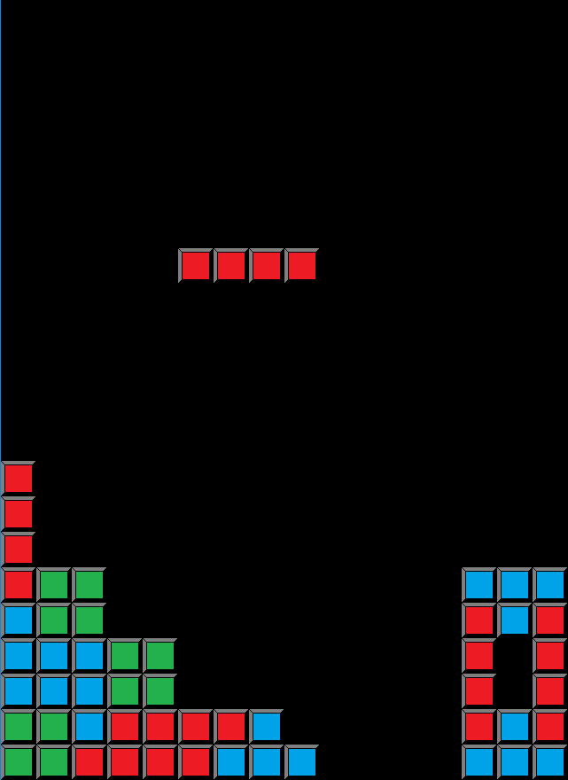

# cpp-blocks

To build via VC++:

Original SDL libraries (make sure to download the VC development libraries):
SDL2: https://www.libsdl.org/download-2.0.php
SDL_image: https://www.libsdl.org/projects/SDL_image/

These need to be referenced to CMake for `libSDL2pp` to pick them up. The SDL development libraries come with both 32-bit and 64-bit binaries so CMake needs to be also told which one of these should be used.

clone the `libSDL2pp` repo: https://github.com/libSDL2pp/libSDL2pp

Place the repo in a folder named `extlib/libSDL2pp` at the root of the project

`cmake .. -G "Visual Studio 15 2017 Win64" -DSDL2PP_WITH_TTF=OFF -DSDL2PP_WITH_MIXER=OFF -DCMAKE_PREFIX_PATH="<your_SDL_folder>/SDL2;<your_SDL_folder>/SDL2_image" -DCMAKE_LIBRARY_ARCHITECTURE=x64`

`MSBuild cpp-blocks.sln`
